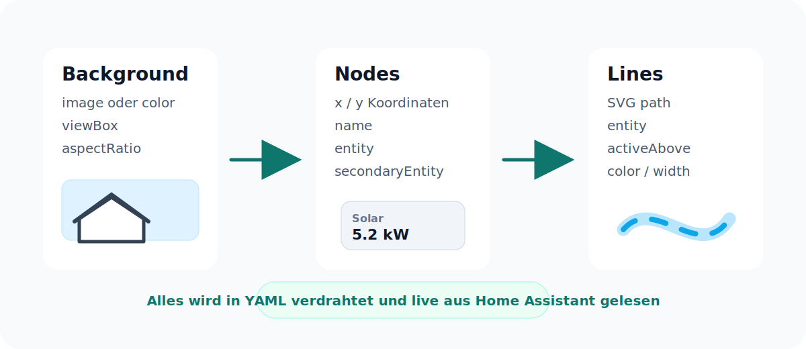

# Energy Flow Builder Card


**Energy Flow Builder Card** ist eine frei konfigurierbare Lovelace Custom Card fuer Home Assistant. Du kannst damit eine eigene animierte Energiefluss-Ansicht bauen: mit eigenem Hintergrundbild, eigenen Koordinaten, eigenen Linien und deinen lokalen Home-Assistant-Entitaeten.

Die Card ist bewusst unabhaengig von bestimmten Herstellern. Es ist egal, ob deine Werte von Sungrow, Fronius, Victron, Shelly, Tibber, Easee, go-e, Viessmann, MQTT oder Template-Sensoren kommen. Wenn Home Assistant eine Entity hat, kann die Card sie anzeigen.

## Was Kann Die Card?

- Solar, Haus, Batterie, Auto/Wallbox, Netz, Heizung oder beliebige eigene Anzeigen darstellen
- jede Anzeige mit einer eigenen Home-Assistant-Entity verbinden
- optional eine zweite Entity pro Anzeige zeigen, zum Beispiel Batterie-Leistung plus Batterie-SoC
- eigene Hintergrundgrafik verwenden
- Labels frei per `x`/`y` positionieren
- Linien frei mit der Maus bearbeiten oder automatisch zwischen zwei Anzeigen verlegen
- Linien anhand von Entity-Werten aktivieren
- Import/Export oder Laden/Entladen ueber positive und negative Werte abbilden
- Farben, Linienbreite, Animation und Schwellenwerte anpassen
- Raster/Snapping, Box-Styling, Vorlagen, Duplizieren sowie Rueckgaengig/Wiederholen nutzen
- Konfiguration als JSON exportieren und wieder importieren

## Grundidee



Die Card besteht aus drei einfachen Bausteinen:

| Baustein | Bedeutung |
| --- | --- |
| `background` | Hintergrundbild, Groesse und SVG-Koordinatensystem. |
| `nodes` | Die Anzeigen, zum Beispiel Solar, Batterie, Auto oder Netz. |
| `lines` | Die animierten Verbindungen zwischen den Anzeigen. |

Du entscheidest selbst, welche Nodes es gibt und welche Entity dahinter steckt.

## Installation

### Manuell

Repository klonen, bauen und die fertige Datei nach Home Assistant kopieren:

```bash
npm install
npm run build
```

Die gebaute Datei liegt danach hier:

```text
dist/ha-energy-flow-builder-card.js
```

Kopiere sie in dein Home-Assistant-Verzeichnis:

```text
config/www/energy-flow-builder-card.js
```

Dann in Home Assistant als Dashboard-Resource eintragen:

```yaml
resources:
  - url: /local/energy-flow-builder-card.js
    type: module
```

Danach kannst du die Card in Lovelace verwenden:

```yaml
type: custom:energy-flow-builder-card
```

### HACS

1. In HACS oben rechts auf die drei Punkte klicken und **Benutzerdefinierte Repositories** waehlen.
2. `https://github.com/psiris22/ha-energy-flow-builder-card` einfuegen.
3. Als Kategorie **Dashboard** waehlen und hinzufuegen.
4. Die Card installieren und Home Assistant einmal neu laden.
5. Unter **Einstellungen > Dashboards > Ressourcen** wird die Resource normalerweise automatisch angelegt. Falls nicht, fuege diese manuell hinzu:

```yaml
url: /hacsfiles/ha-energy-flow-builder-card/ha-energy-flow-builder-card.js
type: module
```

Danach die Card ueber **Karte hinzufuegen** suchen. Der visuelle Editor zeigt alle lokalen Entities aus deinem Home Assistant in Auswahlfeldern an. HACS erkennt neue Commits als Update; Versions-Releases werden zusaetzlich als auswählbare stabile Versionen angeboten.

## Schnellstart

Dieses Beispiel zeigt eine typische Haus-Energieansicht. Ersetze nur die Entity-IDs durch deine eigenen Sensoren.

```yaml
type: custom:energy-flow-builder-card
title: Energiefluss
background:
  image: /local/energy/house.png
  viewBox: "0 0 1073 1466"
  aspectRatio: "1073 / 1466"
defaults:
  activeAbove: 25
  lineWidth: 7
  lineColor: "#16a6d9"
  trackColor: "rgba(22, 166, 217, .26)"
nodes:
  solar:
    x: 385
    y: 330
    name: Solar
    entity: sensor.pv_power
  house:
    x: 760
    y: 520
    name: Haus
    entity: sensor.house_power
  battery:
    x: 385
    y: 1124
    name: Batterie
    entity: sensor.battery_soc
    secondaryEntity: sensor.battery_power
    unit: "%"
    decimals: 0
  wallbox:
    x: 42
    y: 1124
    name: Auto
    entity: sensor.wallbox_power
  heat:
    x: 760
    y: 900
    name: Heizung
    entity: sensor.heat_pump_power
  grid:
    x: 760
    y: 1248
    name: Netz
    entity: sensor.grid_power
lines:
  - id: solar_to_battery
    path: "M600 500 V1100"
    entity: sensor.pv_power
  - id: battery_to_house
    path: "M600 1100 H820 V675"
    entity: sensor.house_power
  - id: battery_to_wallbox
    path: "M600 1100 H200"
    entity: sensor.wallbox_power
  - id: battery_to_heat
    path: "M600 1100 H950 V1050"
    entity: sensor.heat_pump_power
  - id: grid
    pathPositive: "M600 1100 V1300 H900"
    pathNegative: "M900 1300 H600 V1100"
    entity: sensor.grid_power
```

## Visueller Editor

Du musst die Entity-IDs nicht von Hand schreiben. Im Lovelace-Karteneditor erscheinen unter **Anzeigen** Auswahlfelder fuer die primaere und optionale zweite Entity. Die Liste kommt direkt aus deiner laufenden Home-Assistant-Instanz und zeigt Friendly Name sowie Entity-ID. Solar, Haus, Batterie, Auto/Wallbox, Netz und Heizung sind nur vorbereitete Anzeigenamen und koennen umbenannt, verschoben, entfernt oder erweitert werden.

Unter **Anzeigen** wird der **Linienanschluss** pro Box festgelegt. Standard ist **unten mittig**. Unter **Linien** waehlt man bei aktivierter automatischer Verbindung die Anzeige **Von** und **Nach**. Die Linie nutzt jeweils den Anschluss der Box, kann ihn bei Bedarf aber pro Linie überschreiben. Die steuernde Entity-Auswahl zeigt dabei nur Entities, die bereits bei einer Anzeige verwendet werden. Damit ist die Batterie kein fester Mittelpunkt: Jede Anzeige kann mit jeder anderen verbunden werden und die Linie folgt beim Verschieben automatisch. Fuer einen individuellen Verlauf schaltest du die automatische Verbindung aus, aktivierst das Koordinatenraster und ziehst die Punkte direkt in der Vorschau. Doppelklick auf eine Linie fuegt einen weiteren Punkt ein.

Das Koordinatenraster kann optional als Fangraster dienen. Eingeklappte Bereiche bleiben beim Bearbeiten anderer Einstellungen geschlossen. Die obere Werkzeugleiste bietet ausserdem Vorlage, Duplizieren, Rueckgaengig/Wiederholen sowie JSON-Import und -Export.

Solange das Koordinatenraster aktiv ist, lassen sich die Beschreibungsboxen direkt in der Vorschau mit der Maus verschieben. Die neue X/Y-Position wird beim Loslassen automatisch gespeichert. Raster, Koordinaten und Ziehpunkte sind nur im Editor sichtbar, nie auf dem fertigen Dashboard.

Fuer sehr komplexe SVG-Pfade oder alle Detailoptionen kannst du jederzeit im Karteneditor auf den YAML-Modus wechseln.

## Eigene Entitaeten Verbinden

Die Entity-Namen im Beispiel sind nur Platzhalter. Du kannst beliebige lokale Home-Assistant-Entities verwenden:

```yaml
nodes:
  solar:
    name: PV Dach
    entity: sensor.shelly_pv_power
    x: 180
    y: 120

  grid:
    name: Netz
    entity: sensor.smart_meter_power
    x: 720
    y: 620
```

Wichtig ist nur: Der State der Entity sollte eine Zahl sein, wenn die Card daraus Aktivitaet, Richtung oder Geschwindigkeit berechnen soll.

## Netzbezug Und Einspeisung

Fuer bidirektionale Werte nutzt du `pathPositive` und `pathNegative`.

```yaml
lines:
  - id: grid
    entity: sensor.grid_power
    pathPositive: "M600 1100 V1300 H900"
    pathNegative: "M900 1300 H600 V1100"
```

Wenn dein Smart-Meter-Vorzeichen andersherum ist, setze:

```yaml
invert: true
```

## Koordinaten Verstehen

Die Koordinaten beziehen sich auf die `viewBox`. Bei:

```yaml
background:
  viewBox: "0 0 1073 1466"
```

liegt `x: 0, y: 0` oben links und `x: 1073, y: 1466` unten rechts. Ein Node bei:

```yaml
x: 385
y: 330
```

wird also im oberen linken Bereich der Grafik angezeigt.

SVG-Pfade nutzen dasselbe Koordinatensystem:

```yaml
path: "M600 500 V1100"
```

Das bedeutet: Start bei `x=600, y=500`, dann senkrecht bis `y=1100`.

## Konfiguration

### `background`

| Option | Beschreibung |
| --- | --- |
| `image` | Optionales Hintergrundbild, zum Beispiel `/local/energy/house.png`. |
| `color` | Optionaler CSS-Hintergrund, wenn kein Bild genutzt wird. |
| `viewBox` | SVG-Koordinatensystem fuer Nodes und Linien. |
| `aspectRatio` | Seitenverhaeltnis der Card, zum Beispiel `"1073 / 1466"`. |

### `defaults`

| Option | Beschreibung |
| --- | --- |
| `activeAbove` | Standard-Schwelle, ab der Linien animiert werden. |
| `lineWidth` | Standardbreite der Linien. |
| `lineColor` | Standardfarbe der aktiven Linie. |
| `trackColor` | Farbe der ruhenden Hintergrundlinie. |
| `pulseColor` | Farbe der animierten Punkte. |
| `duration` | Standarddauer einer Animation in Sekunden. |
| `labelWidth` | Standardbreite eines Labels. |
| `labelHeight` | Standardhoehe eines Labels. |

### `nodes`

Nodes sind frei benannt. `solar`, `battery` oder `grid` sind keine Pflichtnamen.

| Option | Beschreibung |
| --- | --- |
| `x`, `y` | Position im SVG-Koordinatensystem. |
| `name` | Anzeigename. Wenn leer, wird der Friendly Name der Entity verwendet. |
| `entity` | Primaere Home-Assistant-Entity. |
| `secondaryEntity` | Optionale zweite Entity im Label, zum Beispiel Batterie-State-of-Charge. Sie wird mit ihrer eigenen Einheit wie `%` angezeigt. |
| `unit` | Optionale Einheit, ueberschreibt die Entity-Einheit. |
| `decimals` | Anzahl der Nachkommastellen. |
| `activeAbove` | Eigene Aktivitaetsschwelle fuer diesen Node. |
| `labelWidth`, `labelHeight` | Eigene Label-Groesse. |
| `hide` | Node ausblenden. |
| `connectionPort` | Standard-Linienanschluss der Box: `bottom` (Standard), `top`, `left` oder `right`. |
| `style` | Optionales Styling mit Hintergrund, Rahmen, Textfarben und Eckenradius. |

### `lines`

| Option | Beschreibung |
| --- | --- |
| `id` | Eindeutige ID der Linie. |
| `path` | SVG-Pfad fuer eine einseitige Linie. |
| `pathPositive` | SVG-Pfad fuer positive Entity-Werte. |
| `pathNegative` | SVG-Pfad fuer negative Entity-Werte. |
| `entity` | Entity, die Aktivitaet und Geschwindigkeit steuert. |
| `value` | Fester Wert, falls keine Entity verwendet werden soll. |
| `activeAbove` | Schwelle, ab der die Linie animiert wird. |
| `invert` | Dreht die Vorzeichenlogik um. |
| `width` | Linienbreite fuer diese Linie. |
| `color` | Farbe fuer diese Linie. |
| `trackColor` | Farbe der Hintergrundlinie. |
| `pulseColor` | Farbe der animierten Punkte. |
| `duration` | Animationsdauer in Sekunden. |
| `hideWhenInactive` | Linie unterhalb der Schwelle ausblenden. |
| `source`, `target` | IDs der Start- und Zielanzeige fuer eine automatische Verbindung. |
| `sourcePort`, `targetPort` | Optionaler Anschluss-Override fuer diese Linie. Wenn leer, gilt die Einstellung der jeweiligen Box. |
| `autoRoute` | Linie automatisch zwischen Quelle und Ziel verlegen. |
| `dashPattern` | Eigenes SVG-Strichmuster, etwa `18 80`. |
| `pulseCount` | Anzahl der animierten Punkte von 0 bis 4. |

## Entwicklung

```bash
npm install
npm run check
npm run build
```

Der Produktionsbuild erzeugt:

```text
dist/ha-energy-flow-builder-card.js
```

Ein Push startet die TypeScript- und HACS-Pruefung. Jede neue Paketversion erstellt automatisch ein GitHub Release mit der fertigen JavaScript-Datei. HACS zeigt diese Releases beim Download und bei Updates als auswählbare Versionen an.

## Projektziel

Dieses Projekt soll ein generischer Energiefluss-Baukasten fuer Home Assistant werden. Es soll keine feste Logik fuer bestimmte Hersteller enthalten. Die Card liest nur Home-Assistant-Entities und rendert daraus eine konfigurierbare Ansicht.

## Lizenz

MIT

Dieses Projekt ist von Energiefluss-Visualisierungen im Home-Assistant-Oekosystem inspiriert, enthaelt aber keinen Code von Power Flow Card Plus.
